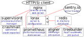

.. Design goals and implementation

Design Assumptions & Goals
==========================
We were not setting out to write the underlying bioinformatics code, but rather
to wrap existing code.  Because multiple codes are needed, the
resulting software would have to be an ecosystem of roughly 7 different
codes rather than a single monolithic package.

Python was chosen as the implementation language because that language
has a rich set of packages needed for implementation.  Python 3 was
chosen over Python 2 because of longevity concerns, despite some
possible dependencies not yet fully supporting Python 3.

We wished to support three distinct Unix platforms (linux, BSD, and MacOS)
for development, testing, and deployment.  Deployment would eventually be
as a non-privileged, non-login user, preferably via a single rc script.
It was desired to keep this rc script as simple as possible because root
access for testing in the production environment was limited.

Only working ``bash`` and C compilers were assumed to be deployment
prerequisites;  everything else needs to be built as a non-privileged user
without depending on a particular package manager.

The primary design goal for lorax was to implement best practices for:

*   Service architecture: make use of RESTful endpoints, with a migration
    path to GraphQL in the near future.  A great deal of effort goes
    into writing (non-scientific) web services these days, so make use
    of those tools and code.
*   Software engineering: write code with low technical debt, suitable
    for re-use later.
*   Testing: use Continuous Integration services and measure code coverage.
*   Deployment: deployment via a small number of scripts, use templating
    to handle the many configuration scripts needed.
*   Monitoring: enable error tracking and performance monitoring.

Conceptual Design
-----------------
An early decision was made to base the service around Flask, because that
application environment was powerful with a large set of plug-ins.  Django
was rejected its strongest advantages (e.g., user authentication)
were not needed, making the additional complexity not worth it.

RQ (Redis Queues) was chosen over Celery because RQ is so much simpler and
smaller.  In the future, we need to implement backfill queueing, and
the code base that would have to be modified is much smaller in RQ.

We need to start and monitor many different processes.  Supervisord seemed
like the best fit for launching and monitoring, despite Python 3 support
being not quite ready.  We forked supervisord and enabled explicit Python 3
support, with installation direct from repository.

The block diagram (from the HTTP point of view) of  processes that run to
implement lorax is shown below:

Red lines in this figure represent http connections (whether over IP or unix
sockets). The components in this software ecosystem are:

* A front-end web proxy (nginx) to handle dispatching, compression, and security.
* A Flask-based service process (lorax) that handles configuration and dispatching
  as well as serving up results.
* A fast database (redis) used for asynchronous communications.
* Calculational queues running (aligner, treebuilder) running multiple binaries.
* A process launcher and manager (supervisord).
* A server for performance and usage stats (prometheus).

